<p align="center">
  <a href="https://laravel.com" target="_blank">
    
  </a>
</p>

<p align="center">
  <a href="https://github.com/laravel/framework/actions"></a>
  <a href="https://packagist.org/packages/laravel/framework"></a>
  <a href="https://packagist.org/packages/laravel/framework"></a>
  <a href="https://packagist.org/packages/laravel/framework"></a>
</p>

# CMS (Content Management System)

[](https://laravel.com)
[](https://php.net)
[](https://spatie.be/docs/laravel-permission)

A comprehensive CMS built with Laravel featuring advanced CRUD generation, granular permissions, and intuitive content management.

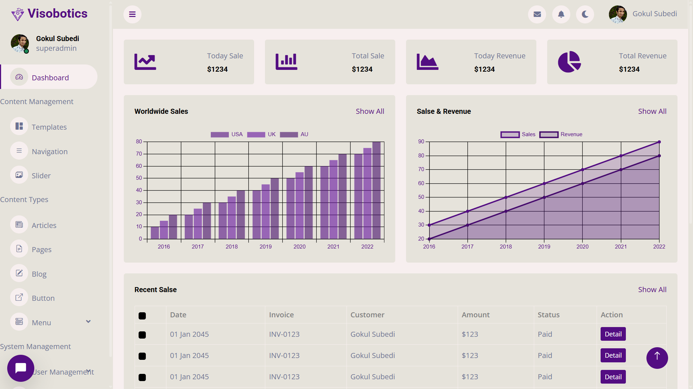

### Dark Mode support

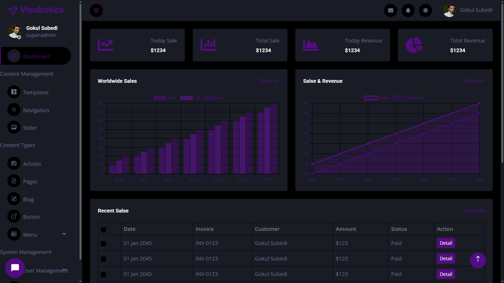

## Table of Contents
- [Features](#features-)
- [Content Management](#content-management-)
- [Role & Permission Management](#role--permission-management-)
- [Installation](#installation-)
- [Custom Commands](#CRUD-Operations-)
- [Security](#security-)
- [Contribution](#contribution-)
- [License](#license-)

## Features ✨

### Core Functionality
- **⚡ Instant CRUD Generation** - Scaffold full modules with artisan commands
- **🔐 Role-Based Access Control** - Granular permissions using Spatie
- **🔄 Dynamic Routing** - Automatic route registration and optimization
- **📊 Dashboard Analytics** - At-a-glance system overview
- **📱 Responsive Design** - Mobile-friendly interface

## Content Management 📝

| Feature               | Preview                      | Description                              |
|-----------------------|------------------------------|------------------------------------------|
| **CRUD Interface**    | 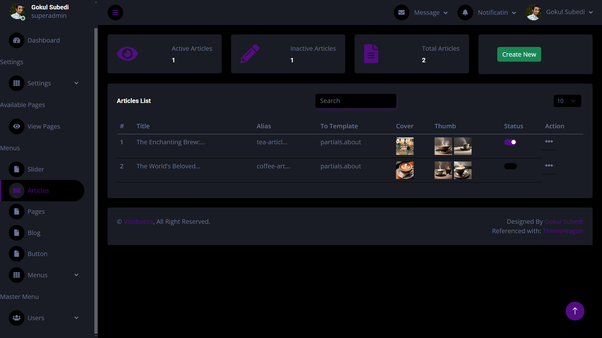 | Full-featured interface for content creation, listing, and management |
| **Drag-n-Drop Sort**  | 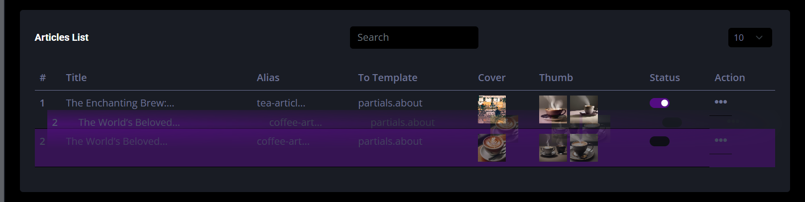 | Visually reorder items with intuitive drag-and-drop functionality |
| **Publish States**    | 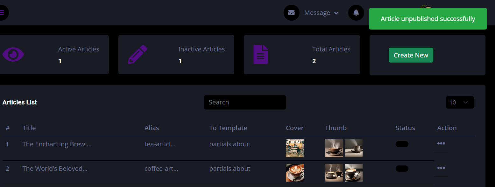 | Toggle between published/draft states with instant status updates |
| **Advanced Search**   | 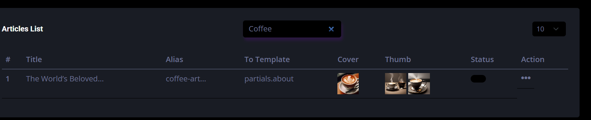 | Filter content using title with real-time results |
| **Detailed View**     | 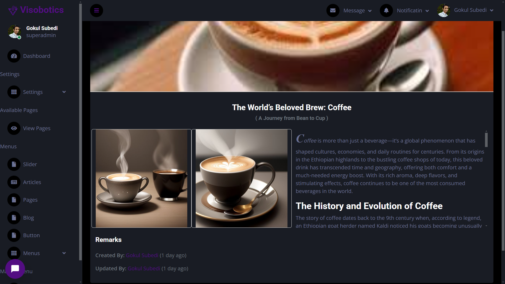 | Comprehensive view showing creator, last editor, and details |

## Role & Permission Management 👥

| Feature               | Preview                      | Description                              |
|-----------------------|------------------------------|------------------------------------------|
| **Roles Listing**     | 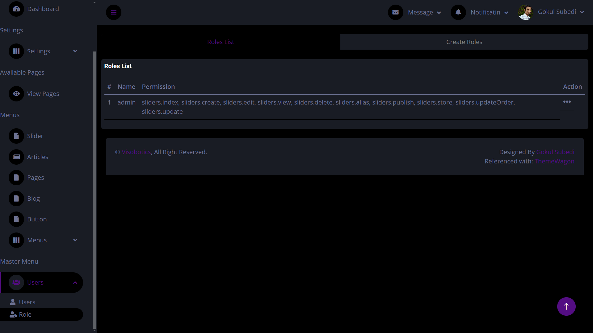 | View all roles with assigned permissions |
| **Role Creation**     | 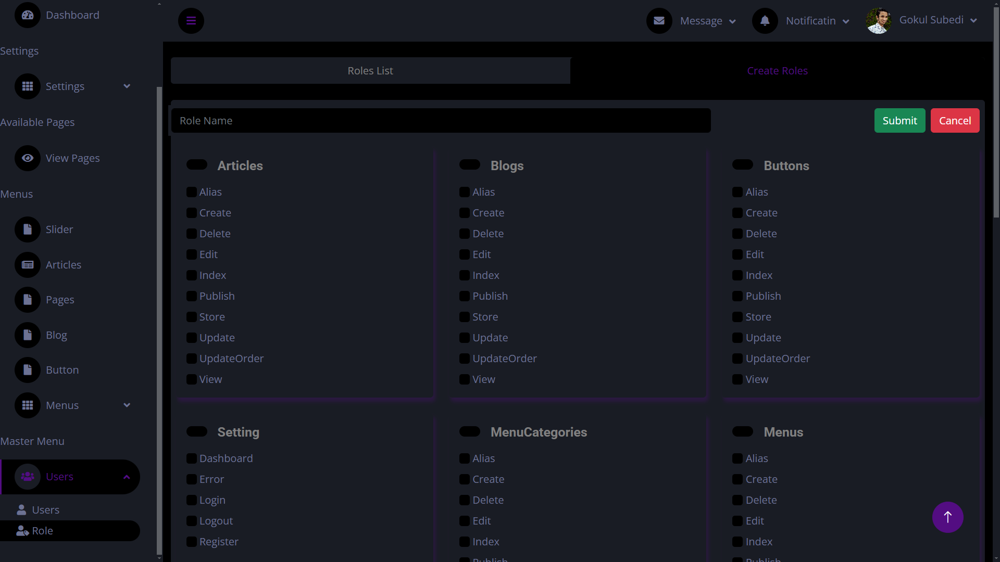 | Create new roles with permission checkboxes |
| **User Assignment**   | 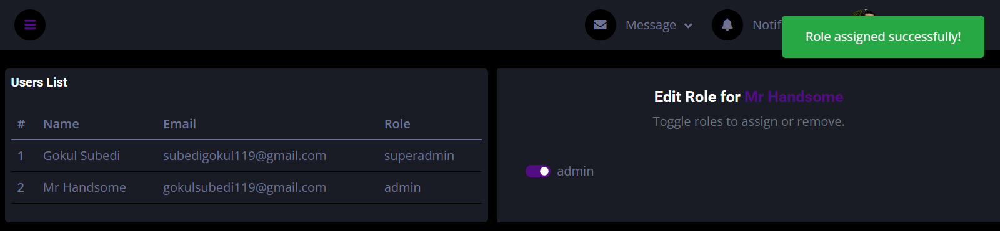 | Assign roles to users through intuitive interface |


### CRUD Operations
```php
# Generate complete CRUD for blogs
php artisan crud:generate blogs
```

```php
# Remove blogs CRUD components
php artisan crud:delete blogs
```
A example crud operation output.
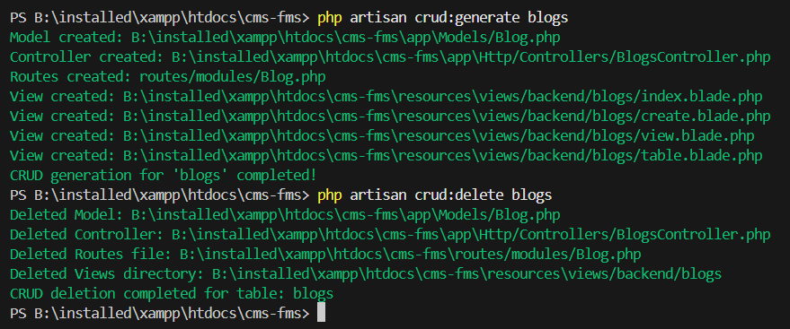


### Initial Setup
```bash
# Setup entire system run this after running 
# on localhost and before navigating to login page
php artisan setup:master
```
## Installation ⚡

### Requirements
- PHP 8.1+ with extensions: BCMath, Ctype, Fileinfo, JSON, Mbstring, OpenSSL, PDO, Tokenizer, XML
- MySQL 8.0+ or MariaDB 10.3+
- Composer 2.5+
- Node.js 18+

```php
git clone https://github.com/MeSafal/project_showcase.git
cd project_showcase
composer install
cp .env.example .env
php artisan key:generate
php artisan migrate
php artisan serve
```
---

## 🤝 License & Contribution

© All rights reserved by [Gokul Subedi](https://github.com/mesafal). This project is closed-source.

Got ideas, feedback, or want to collaborate? I’m open to meaningful contributions and discussions.  
Reach out via [GitHub](https://github.com/meSafal) or email at [subedigokul119@gmail.com](mailto:subedigokul119@gmail.com).

---

> Happy Coding 🙂🙂🙂  
> Contact me if you have any queries.

<sub><p align="center">📘 This repository and its documentation were prepared and maintained by <a href="https://github.com/MeSafal/" target="_blank"><u><strong>Gokul Subedi</strong></u></a>. For the latest updates and related projects, visit <a href="https://github.com/MeSafal" target="_blank">github.com/MeSafal</a>.</p></sub>
